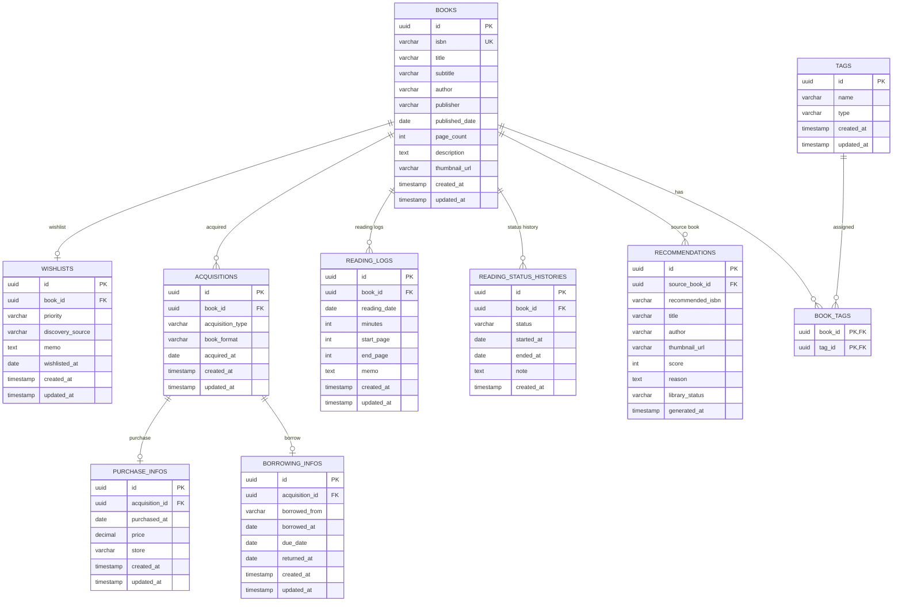

# ER図

## Mermaid

## 補足

### BOOKS

書籍そのものの基本情報を管理する。

### WISHLISTS

「読みたい」というユーザーとの関係を管理する。

### ACQUISITIONS

本をどのように入手したかを管理する。

MVPでは基本1冊1入手でもよいが、将来的な紙 + Kindleなどの複数入手に対応できるよう1:Nで設計する。

### PURCHASE_INFOS

購入した場合の詳細情報。

### BORROWING_INFOS

借用時の詳細情報。返却期限・返却日もここで管理する。

### READING_LOGS

個々の読書記録。

### READING_STATUS_HISTORIES

状態遷移履歴。MVPで必須ではないが、将来的な分析に利用可能。

### RECOMMENDATIONS

AI推薦結果。MVPでは永続化せずオンデマンド生成でもよい。

### TAGS / BOOK_TAGS

ジャンル・テーマ・キーワードを柔軟に管理する。

## Enum

### BookStatus

- Wishlist
- Unread
- Reading
- Paused
- Completed

### Priority

- Low
- Medium
- High

### AcquisitionType

- Purchased
- BorrowedLibrary
- BorrowedPerson
- Gift
- Other

### BookFormat

- Paper
- Kindle
- OtherEBook
- Audiobook

### LibraryStatus

- NotRegistered
- Wishlisted
- Unread
- Reading
- Completed
